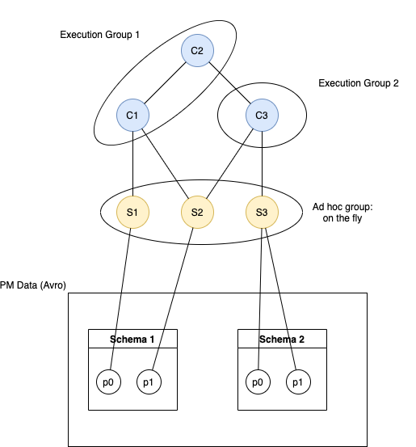

<!--Document Template information:
Prepared:Gunnar Bergdahl
Approved:
Document Name:application-developers-guide-template
Revision: {!.bob/var.application-developers-guide-version!}
Date: {!.bob/var.date!}
-->

# Core Slice Assurance Configurator Application Developers Guide

[TOC]

## Introduction

This document provides guidelines for how to use the Core Slice Assurance Configurator (CSAC) service from an application developer’s point of view.

This guide provides brief descriptions of CSAC's main features and its interfaces. It also provides guidance for defining the JSON resources required for provisioning downstream base capability providers.


### Revision History

| Date         | Comment          | Author  |
|--------------|------------------|---------|
| 2022-12-09   | First draft      | EBETRON |
| 2023-10-03   | AAS Provisioning | EUNIWLE |

## General Concept

On startup, CSAC loads a set of predefined assurance resources for service assurance. CSAC then uses those resources to configure supported base capability providers for assurance as needed for calculation, storage, and visualization of assurance information.

Supported base capability providers for assurance include:

- PM Stats Calculator (PMSC)
- Assurance Augmentation Service (AAS)

Assurance resources include:

- Key performance indicator (KPI) definitions
- Performance metric (PM) definitions required for KPI calculations
- Augmentation definitions
- Profiles providing additional runtime instantiation information, such as context fields, for associating KPI calculations with elements of the topology model

### Assurance Resource Definitions

#### Resource Submission

The ResourceSubmission is the top-level resource required to submit any assurance resource to CSAC for further processing.

```json
{
    "pm_defs": [
      
    ],
    "kpi_defs": [
      
    ],
    "augmentations": [

    ],
    "profiles": [
      
    ]
}
```
_Resource submission example._

| Property Name | Description | Data Type |
|---|---|---|
| pm_defs | List of PM definitions | PM definition list |
| kpi_defs | List of KPI definitions | KPI definition list |
| augmentations | List of augmentation definitions | Augmentation definition list |
| profiles | List of runtime profile definitions | Profile definition list |

See [Resource Dependencies and Resource Deployment](#resource-dependencies-and-resource-deployment) to understand the dependencies between the properties in a ResourceSubmission.

#### PM Definition

PM data is provided as Avro data records on Kafka, where the Avro record is defined by a schema stored in the Data Management and Movement (DMM) Schema Registry and registered in the DMM Data Catalog. In CSAC, PM definitions are used as input for KPI definitions. PM definitions include the fully-qualified PM name as it appears in the Avro schema and the registration information required to look up the Avro schema information from the Data Catalog and Schema Registry. 

```json
{
    "name": "pmCounters.VS_NS_NbrRegisteredSub_5GS",
    "source": "5G|PM_COUNTERS|AMF_Mobility_NetworkSlice_1",
    "description": "PCC v1.21:13.1"
}
```
_PM definition example._

| Property Name | Description | Data Type | Required/Optional |
|---|---|---|---|
| name | fully-qualified PM name. See [PM Name Qualification](#pm-name-qualification) for details. The PM name must match the field name in the referenced Avro schema. | string | required |
| source | Data Catalog registration information for the PM definition. It must be in the format "data space|data category|schema name". | string | required |
| description | description of the PM. In the example above, the Packet Core Controller (PCC) documentation identifier for the PM is shown | string | optional |


##### PM Name Qualification

To accommodate potential variations in different Avro schemas, the PM name must be a fully qualified path to the PM field in the PM data record. For the [example above](#pm-definition), the corresponding Avro record would appear as follows:

```json
{
    ...
    "snssai": "3-1415",
    "pmCounters": {
        "VS_NS_NbrRegisteredSub_5GS": 1
    }
}
```
_Excerpt from an Avro PM data record._

When qualifying a PM name, each sub-schema is separated by a period '.'.

When designing KPIs it is important to note that PM data is collected at 15 minute intervals by Ericsson Network Management (ENM).

PM definitions may be shared by multiple KPI definitions (see [Data Dictionary](#data-dictionary) for more details).


#### KPI Definition

The KPI definition provides an expression for calculating the KPI value for a given collection or aggregation period.  KPI values may be calculated based on raw PM data for a given aggregation period or based on previously calculated KPI values.  

Raw PM data and previously calculated KPI data may not be combined into a single expression; to combine raw and calculated values, the raw values must first be wrapped in a simple KPI definition.  All values for a given KPI expression must be aggregated for the same period (see Note 2, below) and associated with the same topology context.  Aggregation information is provided in the runtime configuration in the profile as described below.

```json
{
    "name": "slice_registered_users_mean",
    "description": "Mean registered subscribers of network slice through AMF",
    "display_name": "Mean Registered Subscribers",
    "expression": "AVG(p0)",
    "aggregation_type": "AVG",
    "is_visible": true,
    "input_metrics": [
        {
            "id": "pmCounters.VS_NS_NbrRegisteredSub_5GS",
            "alias": "p0",
            "type": "pm_data"
        }
    ]
}
```
_KPI definition example._

| Property Name | Description | Data Type | Required/Optional |
|---|---|---|---|
| name | unique name for the KPI definition. The name of each KPI definition must be unique in CSAC. Must match the patter "[A-Za-z_][A-Za-z0-9_]*" | string | required | 
| description | description of the KPI definition. | string | optional |
| display_name | descriptive name for the KPI definition, suitable for visualization.  If not provided, the 'name' will be used | string | optional |
| expression | KPI calculation expression as an SQL fragment.  The expression uses one or more input metrics which may be referenced by name or alias | string | required |
| aggregation_type | specifies the type of aggregation. For example, 'AVG' or 'SUM'.  This field is required for the PM Stats Calculator | string | required |
| is_visible | indicates whether this KPI should be visualized. Default = true | boolean | false |
| input_metrics | list of input metrics for this KPI definition.  All input metrics must be of the same type for a given KPI definition | input metric list | required |

KPI definitions may be shared by multiple profile definitions (see [Data Dictionary](#data-dictionary) for more details).

Note 2. The aggregation period for CSAC KPIs is set to the minimum supported by the PM Stats Calculator. At the time of publication, the minimum aggregation period was 60 minutes.

##### Input Metric

As shown in the above example, the input metric specifies the ID and type of metric. The input metric may, optionally, define an alias to allow simplification of complex or lengthy KPI expressions.

| Property Name | Description | Data Type | Required/Optional |
|---|---|---|---|
| id | input metric ID.  Must refer to the name of a PM definition or KPI definition either present in the same resource submission or previously registered in the Data Dictionary (see [Data Dictionary](#data-dictionary) for more details). | string | required |
| alias | alias for this input metric for this KPI definition | string | optional |
| type | one of "pm_data" or "kpi".  Input metric types must not be mixed in a single KPI definition. To use raw PM data in combination with calculated KPI values, the PM data must first be wrapped in a KPI definition. | enumerated string | required |

#### Augmentation

The augmentation definition specifies the Analytics Reporting Dimensioning Query (ARDQ) resource with additional output fields to generate new augmented schema. This definition adds the ability to provision the Assurance Augmentation Service.

```json
{
  "ardq_url": "${cardq}",
  "ardq_id": "qos1",
  "ardq_type": "ran",
  "ardq_rules": [{
    "input_schema": "EBSN|PM_COUNTERS|PM_EBSN_QOS_1",
    "fields": [{
      "output_fields": ["plmnId", "snssai", "nssi"],
      "input": ["qos", "localDn", "measObjLdn"]
      }
    ]
  }]
}
```
_Augmentation example._

> **_NOTE:_**
>
> If the same augmentation fields are to be added to multiple schemas, and if the same input fields are needed for multiple output fields in the same rule, `input_schemas` and `output_fields` can be used.

> Otherwise, use `input_schema` and `output` for single value.

See [Assurance Augmentation Service](https://adp.ericsson.se/marketplace/assurance-augmentation) for detailed information.

#### Profile

The profile provides runtime information required to instantiate assurance resources in downstream systems.

```json
{
    "name": "5G Slice Assurance Subscriber Profile",
    "description": "Simple profile using a single KPI resource",
    "aggregation_fields": [
        "snssai"
    ],
    "augmentation": "qos1", // Only reference the ardq_id when there is augmentation defined in the resource
    "kpis": [
        {
          "ref": "slice_registered_users_mean",
          "input_metrics": [ // Allow aggregation fields override for KPI input metrics
            {
              "id": "simple_kpi",
              "context": [
                "snssai",
                "cell"
              ]
            }
          ]
        }
    ]
}
```
_Profile definition example._

| Property Name | Description                                                                                                                                                                                                                                                                                                                                                                                                                                                                                                                                                                                                    | Data Type | Required/Optional |
|---|----------------------------------------------------------------------------------------------------------------------------------------------------------------------------------------------------------------------------------------------------------------------------------------------------------------------------------------------------------------------------------------------------------------------------------------------------------------------------------------------------------------------------------------------------------------------------------------------------------------|---|---|
| name | unique name for the profile.  The profile name is only used internally by CSAC to differentiate profile definitions.                                                                                                                                                                                                                                                                                                                                                                                                                                                                                           | string | required |
| description | profile description. The description provides descriptive information for the profile designer and is not used outside of CSAC.                                                                                                                                                                                                                                                                                                                                                                                                                                                                                | string | optional |
| aggregation_fields | list of aggregation fields for KPI calculations.  KPI calculations must be performed in the context of one or more fields available either in the PM records when aggregating PM data or KPI records when calculating based on previously calculated KPI values. Typically, the aggregation fields represent a context in the topology model.  In the example above, the profile can be read as 'Calculate the mean number of registered users for each SNSSAI'.  In practical terms, the aggregation fields are used as columns in the GROUP BY clause when PM Stats Calculator executes the KPI SQL expression. | string array | required |
| augmentation | ardq_id references an existing augmentation configuration. This resource must exist either in the current submission or have been previously defined in the data dictionary | string | optional |
| kpis | list of KPI references.  The KPIs must already be defined, either in the same resource submission as the profile definition or previously registered in the Data Dictionary.                                                                                                                                                                                                                                                                                                                                                                                                                                   | kpi reference list | required |

> **_NOTE:_** By default, input metrics are aggregated using the `aggregation_fields` specified in the profile. This version of CSAC allows more granular aggregation when calculating complex KPIs, the KPI input metric aggregation may be overridden. The context fields list must contain at least one of the `aggregation_fields` in the profile definition, and they must be the same within the `input_metrics` for a complex KPI.


#### Data Dictionary

The Data Dictionary represents a collection of static design-time resources that can be shared by other design-time or run-time resources to simplify assurance resource creation in CSAC.  Dictionary resources are not directly instantiated in downstream systems since they provide only the basic identifiers and expressions required at runtime.  Additional information required to instantiate the resources is provided by runtime definitions such as profiles (see [Runtime Resources](#runtime-resources) for more details).

Data Dictionary resources include:

- PM definitions, which provide reference information for specific PM counters.  PM definitions are referenced in KPI definitions.
- KPI definitions, which provide the KPI calculation expression as an SQL aggregation statement.  The KPI definitions may use either PM definitions or other KPI definitions from the Data Dictionary when constructing their expressions.  KPI instantiation in downstream systems, such as the PM Stats Calculator, is coordinated by the profile which assigns runtime-specific attributes to KPI definitions.  A single KPI definition can be used in multiple KPI definitions and may be referenced in multiple profiles. See [Runtime Resources](#runtime-resources) for more details.
- Augmentation definitions, which configure the Assurance Augmentation Service (AAS). AAS configuration is necessary if the KPI designer requires augmented context fields.

#### Runtime Resources

Runtime resources can be broken into two separate areas:  runtime resource definitions and generated runtime resources.  The only runtime definition currently supported is the Profile, which is used to associate one or more KPI definitions with the additional attributes required to calculate and visualize the KPI in a specific topology context.

### Resource Dependencies and Resource Deployment

There is a clear set of dependencies between resources:  

1. PM definitions must be created in the Data Dictionary before they can be referenced by KPI definitions.
1. KPI definitions must exist in the Data Dictionary before they can be referenced by other KPI or Profile definitions. 
1. Augmentation definitions must exist in the Data Dictionary before they can be referenced by Profile definitions. A Profile definition can use augmented data fields for aggregation.

To accommodate rapid development, all resources and their dependencies can be defined in a single resource submission.

Resources are deployed using Kubernetes ConfigMap objects.  Each ConfigMap must create JSON files in the CSAC container file system under the path defined in the CSAC Helm chart.  The path is specified by the `csac.resource.path` parameter.  The default path is `/config/resources`. For local development purposes, the default path can be overridden in application-prod.yaml.

#### Out Of Box Resource Files

As described in [Resource Dependencies and Resource Deployment](#resource-dependencies-and-resource-deployment), the out-of-box (OOB) CSAC resources are deployed as JSON files using the resource ConfigMap described below.  By default, CSAC is deployed with the following OOB resource files:

- csac-oob-kpi-defs.json

To ensure that OOB files are loaded correctly, a list of OOB files to be installed is specified in CSAC's 'values.yaml' file as follows:

```yaml
csac:
  resource:
    # list of out-of-box resource files. Files will be loaded in the order
    # they are listed below.  OOB files are always loaded and validated
    # before custom resources are loaded.
    oob:
      - 'csac-oob-kpi-defs.json'
```

If a given OOB file is not required for a given deployment, this list can be overridden during CSAC deployment.  OOB files are loaded in the order specified in the values.yaml file.  When an OOB file is named using the convention for custom resource files (see [Customizing Assurance Resources](#customizing-assurance-resources)). CSAC will load the file as an OOB file and will not load it again as a custom resource file.

> **_NOTE:_**  This version of CSAC includes only the OOB resource file listed above. Subsequent versions may include additional OOB resource files.

#### Resource Config Maps

CSAC defines two resource ConfigMap types in its Helm chart:

- _eric-oss-core-slice-assurance-cfg-resource-config_: provides all the OOB PM, KPI, and Profile definitions.  This Kubernetes ConfigMap can be modified after CSAC is deployed if additional KPIs are needed. However, any modification should be done with caution as it may impact the OOB behavior of the existing KPIs.
- _eric-oss-core-slice-assurance-cfg-custom-resource-config_: placeholder for custom configuration. See [Customizing Assurance Resources](#customizing-assurance-resources) for more details.

#### Customizing Assurance Resources

Additional Assurance resources such as PM , KPI , or profile definitions can be added, either before or after CSAC deployment as follows:

1. Define the resources in one or more JSON files.
1. Add the files to a Kubernetes ConfigMap called `eric-oss-core-slice-assurance-cfg-custom-resource-config` as shown below:

```bash
$ kubectl create configmap eric-oss-core-slice-assurance-cfg-custom-resource-config --from-file=/local/path/to/file
```
_Create ConfigMap from file_

where `/local/path/to/file` can be a path to a single file or a path to a directory containing multiple files.  Please see the official [Kubernetes Documentation](https://kubernetes.io/docs/tasks/configure-pod-container/configure-pod-configmap/#create-a-configmap) for more details.

Custom resource files must have a sequence number appended to the filename to ensure that files are loaded in the correct sequence.  This ensures that dependencies are loaded in the correct sequence provided they are specified in the correct sequence in the numbered files.  It is also important to remember that each custom JSON file must contain a single resource submission that contains the resource lists to be loaded. It is not mandatory that a single JSON file contain all PM definitions, KPI definitions, and Profile definitions for a given submission.

Files are loaded in the following sequence:

1. OOB KPI resource file (always gets loaded first)
1. File_1.json
1. File_2.json
1. etc.

Using the above file loading example, the KPIs or Profiles defined in File_1.json can refer to PM definitions and KPIs defined in the OOB KPI resource file.  KPIs or Profiles defined in File_2.json can refer to PM definitions or KPIs defined in the OOB KPI resource file or File_1.json and so on.  Any file loaded before its dependencies have been loaded will cause an error and CSAC will reject all the input.

## Application Integration

This section describes the integration of CSAC with downstream systems, and provides detailed descriptions of the resulting configuration in each system.

### PM Stats Handler

The PM Stats Handler is an external application and part of the base capabilities for assurance. It provides KPI calculation and export functionality.  The PM Stats Handler application comprises three main services:

1. PM Stats Calculator.  This service provides KPI definition and calculation functionality.
1. PM Exporter.  This service exports calculated KPI values via Kafka.
1. KPI Query Service.  This service provides basic KPI query functionality using an HTTP REST API.

CSAC transforms the PM and KPI definitions defined in the Data Dictionary into runtime PM Stats Calculator (PMSC) KPI definitions. The CSAC runtime Profile definitions provide the required aggregation information.  CSAC then submits the runtime KPI definitions to PMSC and triggers their calculation. All CSAC-defined KPIs are calculated continuously at regular intervals defined in the PMSC (see Note 3, below).

#### PM Stats Calculator KPI Model

PMSC defines two basic types of KPIs:

- Simple KPI which uses raw PM counter data.
- Complex KPI which uses previously calculated KPI values.

When defining simple KPIs, the PMs specified for the KPI expression must be included in the same PM Avro record.

KPIs are modeled hierarchically in PMSC where simple KPIs are used to calculate complex KPIs, which can then be used to calculate additional complex KPIs.  Furthermore, PMSC groups KPIs using 'execution groups'.  Complex KPIs defined in an execution group may reference other KPIs from the same group in memory while KPIs defined in different execution groups must be referenced from the PMSC database.  Simple KPIs are always calculated in an ad-hoc execution group.  CSAC manages all explicit execution group definitions internally based on the runtime profile definition.

The general model for building KPIs in PMSC is shown below.



_Figure 1. PMSC KPI Model_


#### CSAC Runtime KPI Definitions

When generating the runtime KPI definitions for submission to PMSC, CSAC adds the following information to complete the runtime definition:

- runtime KPI definition name. PMSC requires a unique name for each runtime instance.  KPI definition names in PMSC are also used as column names in the PMSC KPI database schema.  Because CSAC KPI definitions are shareable across multiple profiles, CSAC generates a unique name for each unique runtime KPI definition and stores the mapping between the KPI definition, aggregation details, and the runtime KPI definition name.
- aggregation fields.  Each KPI calculation is an aggregation operation
- input data identification.  This is required by simple KPIs and corresponds to the `source` field in the CSAC PM definition. If an augmented field is used, it will be the augmented schema name
- execution group specification.  Currently, CSAC uses a single CSAC-specific execution group for all OOB KPI definitions.
- KPI alias. This is required by PMSC to generate the database schema for calculated KPI values.

#### PM Stats Calculator Database Schema

The PMSC stores all calculated KPI values in its local persistent store.  The naming convention for KPI tables in PMSC is as follows:

```sql
<alias>_<agg field 1>[_<agg field 2> etc]_<agg period>.
```

where

- _alias_ is the KPI alias defined by CSAC.  CSAC uses a common alias `csac` for all runtime KPI definitions.
- _agg field 1,2,3..._ is each aggregation field included in a given PMSC KPI definition.
- _agg period_ is the aggregation period for the KPI calculation.  CSAC uses the same aggregation period for all KPI definitions. Ssee Note 3, below.

The tables include columns for the aggregation period start and end timestamps in UTC, the aggregation fields, and the KPI values.  Using the simple KPI shown in [Assurance Resource Definitions](#assurance-resource-definitions) above, a table similar to the one shown below will be created by PMSC:

Table: **csac_snssai_60**

Begin Timestamp (see Note 4, below) | End Timestamp (see Note 4, below) | snssai | csac-a445b443-d394-486a-b0eb-9d93b6fe5907
---|---|---|---

The KPI Query Service exposes the data in the KPI tables similar to the table above.

#### PM Exporter Avro Record

As the KPIs are calculated, they are exported as Avro records where a single record represents a single row from a given table.  For the table shown above, the record might appear as follows (see Note 4, below):

```json
{
    "begin_timestamp": "2022-12-12T15:00:00Z",
    "end_timestamp": "2022-12-12T15:59:59Z",
    "snssai": "3-1415",
    "csac-a445b443-d394-486a-b0eb-9d93b6fe5907": 1.000000
}
```

A service consuming this record will require runtime CSAC configuration to correlate the PMSC KPI with the CSAC definition.

Note 3. At publication, the aggregation period for KPIs in PMSC was 60 minutes.

Note 4. At publication, the exact names of the timestamp columns and fields were not known.

### Assurance Augmentation Service

The Assurance Augmentation Service is an external application and part of the base capabilities for assurance. It provides the ability to augment fields to a given schema.

With this integration, CSAC provides augmentation configuration for AAS if the KPI designer requires augmented context fields.

The augmentation configuration is a new optional element in the Resource Submission model. Augmentation is an array of AAS configuration, each comprising the following fields:

- ardq_id: unique identifier for the AAS configuration. The value is globally unique within CSAC and will be used as the ARDQ ID when registering the configuration in AAS (Required)
- ardq_type: type of augmentation processing which will be performed, for example core or RAN topology augmentation. Possible values will be determined by the target ARDQ service, as identified in the `ardq_url` (Required)
- ardq_url: a URL for the ARDQ provider. This includes the scheme, hostname or IP address, and port. Or a placeholder, whose value is defined in the values.yaml file *provisioning.aas.ardq.cardq* (Optional)
- ardq_rules: a list of rules which each specify the augmentation to be performed by the AAS for a single augmented field (Required). Each rule comprises:
  - input_schema: source schema reference for the input fields. This is in same format as the source field in the PMDefinition model. This field would normally contain the schema reference for the PM data parser schema.
  - fields: the input fields list required by the ARDQ to calculate the value of the output field, and output field to be added to an augmented record by AAS

## Debugging CSAC Resource Definitions

CSAC loads, validates, and provisions Assurance resources in a batch operation on startup.  As a result, debugging resource definitions such as KPIs during development can be difficult because it requires a full running system with a live database and live or mocked downstream services such as the PM Stats Calculator.

Dry run execution mode allows a developer to update their resource definition files and verify the changes without any external dependences.

### Dry Run Execution

Dry run mode operates similarly to production mode except that all external dependencies are bypassed.

Dry run mode is enabled by specifying the 'dry-run' Spring profile when starting CSAC.  For example, executing version '1.1.1' in dry-run mode with a single OOB resource file:

```bash
$ java -jar eric-oss-core-slice-assurance-cfg-1.1.1.jar --spring.profiles.active=dry-run --server.port=8080 --csac.resource.oob=csac-oob-kpi-defs.json --csac.resource.path=/opt/cenx/csac/resource
```

When running in dry-run mode, CSAC behaves as follows:

- resource validation is enabled.  CSAC will validate the resource files loaded from disk in the same way as it does in production with the exception of validation requiring external services.
- live database connection is disabled.  All dictionary and runtime resources are stored in memory.
- live provisioning of downstream services is disabled.  Instead, the output for the services is calculated and logged.

> :warning: Dry run execution mode is not intended for deployment to Kubernetes.  It can only be used when running locally from the command line or development environment.

#### Dry Run Properties

To run in dry run mode, the following properties _must_ be specified on the command line:

| Property | Value | Required | Description |
|---|---|---|---|
| spring.profiles.active | dry-run | yes |  dry-run must be the only active profile |
| csac.resource.path | /path/to/resources | yes | This must be the full path to the directory contianing the resources files |
| csac.resource.oob | oob-file-1.json, oob-file-2.json, etc | no | Optional comma-delimited list of resource file to be loaded as OOB files. If no files are specified, only custom resource files will be loaded. |

#### Incremental Resource Updates

In the current release, CSAC does not support incremental configuration updates in production.  In a development environment, however, it may be desirable to reset and reload the CSAC configuration without restarting the CSAC microservice.  The `resource` endpoint is used to reset or reload the Assurance configuration resources.

| ID | Description |
| -- | ----------- |
| resource | Resets or reloads Assurance configuration |

> **Note** The `resource` endpoint can be used in a lab or production environment to correct a deployment in which an inconsistency is suspected in the Assurance configuration.

##### Reloading Configuration in a Running CSAC Instance

```bash
$ curl 'http://localhost:8080/actuator/resource/reload' -i -X POST
```

A response similar to the following is returned

```bash
HTTP/1.1 200 OK
Date: Fri, 08 Sep 2023 15:54:21 GMT
Content-Type: text/plain;charset=utf-8
X-Content-Type-Options: nosniff
X-XSS-Protection: 1; mode=block
Cache-Control: no-cache, no-store, max-age=0, must-revalidate
Pragma: no-cache
Expires: 0
X-Frame-Options: DENY
Content-Length: 37

CSAC resource configuration reloaded
```

##### Response Structure

The response contains a string message indicating that the configuration was reloaded.

``` bash
CSAC resource configuration reloaded
```

##### Resetting Assurance Configuration

```bash
$ curl 'http://localhost:8080/actuator/resource/reset' -i -X DELETE
```

Resetting Assurance configuration deletes all configured resources in Assurance provisioning targets, including

- Assurance Augmentation
- Assurance Indexing
- PM Stats Calculator

In addition, the CSAC dictionary and runtime data stores will be purged, restoring CSAC to a pre-deployment state.  Resources can be restored either by redeploying or restarting CSAC or by invoking the resource reload endpoint described below.

The preceding example resets Assurance configuration in all provisioning targets and the CSAC data store. The response is similar to the following:

```bash
HTTP/1.1 204 No Content
Date: Fri, 08 Dec 2023 21:43:44 GMT
X-Content-Type-Options: nosniff
X-XSS-Protection: 0
Cache-Control: no-cache, no-store, max-age=0, must-revalidate
Pragma: no-cache
Expires: 0
X-Frame-Options: DENY
```

> :warning: The reset operation will delete all configuration in all provisioning targets and should only be performed when Assurance configuration is no longer viable or no longer needed.  In the event of an error during the reset operation, the operation will cease and the configuration may be left in an inconsistent state.  The underlying condition for the reset failure should be corrected and the reset operation repeated until the operation completes successfully.


## Interfaces

CSAC does not provide any interfaces for application development or external integration.

## Appendix

### Sample Resource Submission

```json
{
  "pm_defs": [
    {
      "name": "pmCounters.VS_NS_NbrRegisteredSub_5GS",
      "source": "eric-data-message-bus-kf:9092|topic0|AMF_Mobility_NetworkSlice",
      "description": "PCC v1.21:13.1"
    }
  ],
  "kpi_defs": [
    {
      "name": "slice_registered_users_mean",
      "description": "Mean registered subscribers of network slice through AMF",
      "display_name": "Mean Registered Subscribers",
      "expression": "AVG(p0)",
      "aggregation_type": "AVG",
      "is_visible": true,
      "input_metrics": [
        {
          "id": "pmCounters.VS_NS_NbrRegisteredSub_5GS",
          "alias": "p0",
          "type": "pm_data"
        }
      ]
    }
  ],
  "profile_defs": [
    {
      "name": "5G Slice Assurance Subscriber Profile",
      "description": "First simple profile using a single KPI resource",
      "aggregation_fields": [
        "snssai"
      ],
      "kpis": [
        {
          "ref": "slice_registered_users_mean"
        }
      ]
    }
  ]
}
```

## References

[Create A ConfigMap](https://kubernetes.io/docs/tasks/configure-pod-container/configure-pod-configmap/#create-a-configmap)
