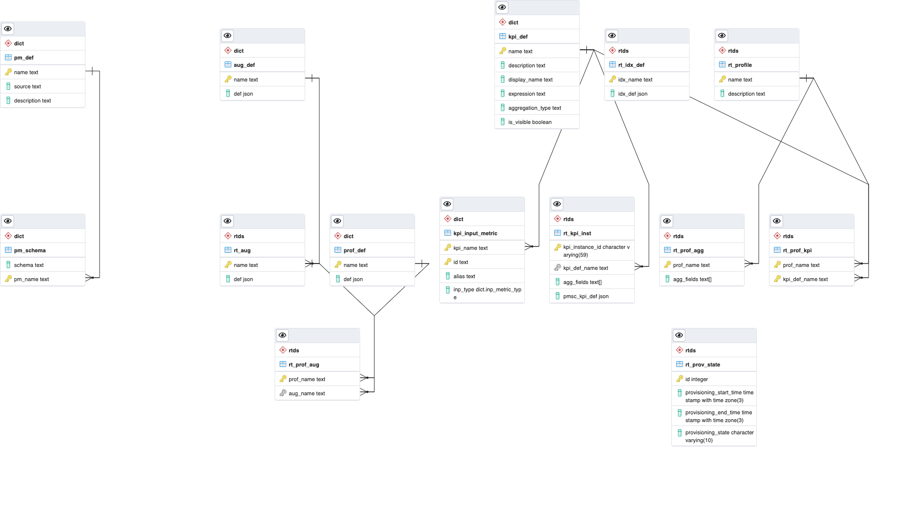

# Core Slice Assurance Configurator Database Schema

This document provides a detailed description of the database schema for the Core Slice Assurance Configurator (CSAC) microservice.

## Background

The CSAC microservice provides centralized configuration of core services related to a set of statically defined, out-of-box (OOB) KPIs required for core slice assurance.  The configuration is provided in two parts:

1. Data dictionary, comprising assurance profile definitions to identify and calculate differences in resources. It also comprises reusable PM, KPI
   and augmentation definitions.
1. Runtime configuration, comprising assurance profiles used to create runtime instances of KPI definitions, KPI instances configured in the PM Stats
   Calculator (PMSC), and related augmentation and indexer configuration.

## Schemas

The CSAC database is defined in two schemas, aligning with the type of data being stored.  The schema names are:

1. `dict` - for data dictionary data
1. `rtds` - for the runtime data store


> NOTE: EDB is managed by an external DBA; schema names might be customized in production.


## ERD


_Figure 1. CSAC Database ERD_

### Data Dictionary

One of the design principles for assurance profiles is that they are _composable_, which means that a profile creator can select from a set of predefined resources, using the profile to then provide additional runtime-specific information to define the runtime configuration of assurance resources.  For example, a given KPI definition may define an expression to calculate the KPI value for a given set of known PM counters.  Two different profiles can refer to the same KPI definition, but aggregate the calculations differently to provide different views of the same KPI.

#### DDL SQL

> NOTE: EDB is managed by an external DBA; DB user may not be 'csac_user' as shown below
```SQL
SET search_path TO "dict";

CREATE TABLE IF NOT EXISTS pm_def (
  name text CONSTRAINT pk_pm PRIMARY KEY,
  source text NOT NULL,
  description text
);

ALTER TABLE IF EXISTS pm_def OWNER TO csac_user;

CREATE TABLE IF NOT EXISTS pm_schema (
  schema text NOT NULL,
  pm_name text NOT NULL,
  PRIMARY KEY (schema, pm_name),
  CONSTRAINT fk_pm_name
    FOREIGN KEY(pm_name)
    REFERENCES pm_def(name)
    ON DELETE CASCADE
);

ALTER TABLE IF EXISTS pm_schema OWNER TO csac_user;

CREATE TABLE IF NOT EXISTS kpi_def (
  name text CONSTRAINT pk_kpi PRIMARY KEY,
  description text,
  display_name text,
  expression text NOT NULL,
  aggregation_type text NOT NULL,
  is_visible boolean NOT NULL DEFAULT true
);

ALTER TABLE IF EXISTS kpi_def OWNER TO csac_user;

CREATE TYPE inp_metric_type AS ENUM ('pm_data', 'kpi');

CREATE TABLE IF NOT EXISTS kpi_input_metric (
  kpi_name text NOT NULL,
  id text NOT NULL,
  alias text,
  inp_type inp_metric_type NOT NULL,
  PRIMARY KEY (kpi_name, id),
  CONSTRAINT fk_kpi_inp_metric
    FOREIGN KEY(kpi_name)
    REFERENCES kpi_def(name)
    ON DELETE CASCADE
);

ALTER TABLE IF EXISTS kpi_input_metric OWNER TO csac_user;
```

#### Sample DML SQL

##### Insert New PM Definition Using CTE

```SQL
WITH pm_insert AS (
  INSERT INTO dict.pm_def(name, source, description) 
  VALUES ('VS_NS_NbrRegisteredSub_5GS', '5G/PM_COUNTER/schemaName1', 'Free form description')
  RETURNING name
)
INSERT INTO dict.pm_schema(schema, pm_name)
  SELECT 'schemaName1', name FROM pm_insert;
```

##### Insert New KPI Definition Using CTE

```SQL
WITH kpi_insert AS (
INSERT INTO dict.kpi_def(name, expression, aggregation_type, is_visible) 
  VALUES ('slice_registered_users_mean', 'AVG(p0)', 'AVG', true)
  RETURNING name
) 
INSERT INTO dict.kpi_input_metric(id, alias, inp_type, kpi_name)
  SELECT 'VS_NS_NbrRegisteredSub_5GS', 'p0', 'pm_data', name FROM kpi_insert;
```

### Runtime Data Store

#### DDL SQL

```SQL
SET search_path TO "rtds";

CREATE TABLE IF NOT EXISTS rt_profile (
  name text constraint pk_prof_nm PRIMARY KEY,
  description text
);

ALTER TABLE IF EXISTS rt_profile OWNER TO csac_user;

CREATE TABLE IF NOT EXISTS rt_prof_kpi (
  prof_name text,
  kpi_def_name text,
  PRIMARY KEY (prof_name, kpi_def_name),
  CONSTRAINT fk_prof_kpi
    FOREIGN KEY(kpi_def_name)
    REFERENCES ${dictionarySchemaName}.kpi_def (name)
    ON DELETE RESTRICT,
  CONSTRAINT fk_prof_kpi_prof
    FOREIGN KEY(prof_name)
    REFERENCES rt_profile (name)
    ON DELETE CASCADE
);

ALTER TABLE IF EXISTS rt_prof_kpi OWNER TO csac_user;

CREATE TABLE IF NOT EXISTS rt_prof_agg (
  prof_name text CONSTRAINT pk_prof_agg PRIMARY KEY,
  agg_fields text[] NOT NULL CHECK (cardinality(agg_fields) > 0),
  CONSTRAINT fk_prof_agg
    FOREIGN KEY(prof_name)
    REFERENCES rt_profile (name)
    ON DELETE CASCADE
);

ALTER TABLE IF EXISTS rt_prof_agg OWNER TO csac_user;

CREATE TABLE IF NOT EXISTS rt_kpi_inst (
  kpi_instance_id varchar(59) PRIMARY KEY,
  kpi_def_name text NOT NULL,
  agg_fields text[] NOT NULL CHECK (cardinality(agg_fields) > 0),
  pmsc_kpi_def json NOT NULL,
  UNIQUE (kpi_def_name, agg_fields),
  CONSTRAINT fk_kpi_inst_kpi
    FOREIGN KEY(kpi_def_name)
    REFERENCES ${dictionarySchemaName}.kpi_def (name)
    ON DELETE RESTRICT
);

ALTER TABLE IF EXISTS rt_kpi_inst OWNER TO csac_user;


```

#### Sample DML SQL

##### Insert New Runtime Profile

`NOTE: If executing the inserts as separate statements, as shown in the examples below, the inserts must be part of the same transaction`

```SQL
INSERT INTO rtds.rt_profile (name, description)
  VALUES ('5G Slice Assurance Subscriber Profile', 'Free form description');

INSERT INTO rtds.rt_prof_agg (prof_name, agg_fields)
  VALUES ('5G Slice Assurance Subscriber Profile', ARRAY ['snssai']);

INSERT INTO rtds.rt_prof_kpi (prof_name, kpi_def_name)
  VALUES ('5G Slice Assurance Subscriber Profile', 'slice_registered_users_mean');
```

##### Insert New Runtime KPI Instance

`NOTE: The KPI JSON in the example below is an arbitrary example and does not match the data in the previous examples`

```SQL
INSERT INTO rtds.rt_kpi_inst (kpi_instance_id, kpi_def_name, agg_fields, pmsc_kpi_def)
  VALUES ('csac_8dd2a734_473b_4873_9cc1_65e062e65281', 'slice_registered_users_mean', ARRAY['snssai'], '{"name":"sum_integer_1440_simple","alias":"cell_guid_simple","expression":"SUM(fact_table_0.integerColumn0)","object_type":"INTEGER","aggregation_type":"SUM","aggregation_period":1440,"aggregation_elements":["fact_table_0.agg_column_0"],"is_visible":true,"inp_data_category":"pm_data","inp_data_identifier":"eric-data-message-bus-kf:9092|topic0|fact_table_0"}');

```

### Assurance Augmentation Service(AAS) Provisioning Support

#### DDL SQL

```SQL
SET search_path TO dict;
CREATE TABLE IF NOT EXISTS aug_def (
   name text CONSTRAINT pk_aug PRIMARY KEY,
   def json NOT NULL
);

ALTER TABLE IF EXISTS aug_def OWNER TO csac_user;

CREATE TABLE IF NOT EXISTS prof_def (
    name text CONSTRAINT pk_prof PRIMARY KEY,
    def json NOT NULL
);

ALTER TABLE IF EXISTS prof_def OWNER TO csac_user;

INSERT INTO prof_def (name, def) SELECT t.name, t.profile FROM
(SELECT j.name, row_to_json(j) AS profile FROM
(SELECT p.name, p.description, a.agg_fields, json_agg(json_build_object('ref',k.kpi_def_name)) AS kpis
FROM ${runtimeDatastoreSchemaName}.rt_profile p, ${runtimeDatastoreSchemaName}.rt_prof_kpi k, ${runtimeDatastoreSchemaName}.rt_prof_agg a
WHERE name=k.prof_name AND name=a.prof_name
GROUP BY name, a.agg_fields) j) t;


SET search_path TO rtds;
CREATE TABLE IF NOT EXISTS rt_aug (
  name text CONSTRAINT pk_rt_aug PRIMARY KEY,
  def json NOT NULL,
  CONSTRAINT fk_rt_aug
     FOREIGN KEY(name)
     REFERENCES ${dictionarySchemaName}.aug_def (name)
     ON DELETE CASCADE
);

ALTER TABLE IF EXISTS rt_aug OWNER TO csac_user;

CREATE TABLE IF NOT EXISTS rt_prof_aug (
  prof_name  text CONSTRAINT pk_prof_aug PRIMARY KEY,
  aug_name text NOT NULL,
  CONSTRAINT fk_prof_aug_prof
     FOREIGN KEY(prof_name)
     REFERENCES ${dictionarySchemaName}.prof_def (name)
     ON DELETE CASCADE,
  CONSTRAINT fk_prof_aug_aug
       FOREIGN KEY(aug_name)
       REFERENCES rt_aug (name)
       ON DELETE CASCADE
);

```

#### Sample DML SQL

`NOTE: The data in the example below is an arbitrary example and does not match the data in the previous examples`

##### Insert New Profile Definition in Dictionary

```SQL
INSERT INTO dict.prof_def (name, def)
  VALUES ('5G Slice Assurance Subscriber Profile', '{"name":"5G Slice Assurance Subscriber Profile","description":"First simple profile using a single KPI resource","augmentation":"cardq","aggregation_fields":["snssai"],"kpis":[{"ref":"slice_registered_users_mean"}]}');
```

##### Insert New Augmentation in Dictionary

```SQL
INSERT INTO dict.aug_def (name, def)
  VALUES ('cardq', '{"ardq_id":"cardq","ardq_type":"core","ardq_url":"${cardq}","ardq_rules":[{"input_schema":"5G|PM_COUNTERS|AMF_Mobility_NetworkSlice_1","fields":[{"output": "nsi","input":["snssai","moFdn"]}]}]}');
```

##### Insert New Runtime Augmentation

```SQL
WITH aug_insert AS (
  INSERT INTO rtds.rt_aug (name, def)
  VALUES ('cardq', '{"ardq_id":"cardq","ardq_type":"core","ardq_url":"${cardq}","ardq_rules":[{"input_schema":"5G|PM_COUNTERS|AMF_Mobility_NetworkSlice_1","fields":[{"output": "nsi","input":["snssai","moFdn"]}]}]}');
  RETURNING name
)
INSERT INTO rtds.rt_prof_aug (prof_name, aug_name)
  SELECT '5G Slice Assurance Subscriber Profile', name FROM aug_insert;
```

### Assurance Indexing Service(AAS) Provisioning Support

#### DDL SQL

```SQL
SET search_path TO rtds;
CREATE TABLE IF NOT EXISTS rt_idx_def (
   idx_name text CONSTRAINT pk_rt_idx PRIMARY KEY,
   idx_def json NOT NULL
);

ALTER TABLE IF EXISTS rtds.rt_idx_def
  OWNER TO csac_user;
```

#### Sample DML SQL

> NOTE: The data in the example below is an arbitrary and does not match the data in the previous examples. The deployed index definition example value is shortened for brevity.

```SQL
INSERT INTO rtds.rt_idx_def (idx_name, idx_def)
  VALUES ('ESOA-2-Indexer', '{...}')
```

### Provisioning State

#### DDL SQL

```
SET search_path TO rtds;

ALTER TABLE IF EXISTS rt_prof_aug OWNER TO csac_user;

CREATE TABLE IF NOT EXISTS rt_prov_state (
  id serial primary key,
  provisioning_start_time timestamp(3) with time zone,
  provisioning_end_time timestamp(3) with time zone,
  provisioning_state varchar(10));

ALTER TABLE IF EXISTS rt_prov_state
  OWNER TO csac_user;
```

#### Sample DML SQL

> NOTE: The data in the example below is an arbitrary and does not match the data in the previous examples.

##### Insert Provisioning State

```
INSERT INTO rtds.rt_prov_state (provisioning_start_time, provisioning_state)
  VALUES(current_time, 'STARTED')
```

##### Update Provisioning State On Successful Provisioning

```
UPDATE rtds.rt_prov_state
  SET provisioning_end_time = current_time, provisioning_state = 'COMPLETED'
  WHERE id = (SELEECT MAX(id) FROM rtds.rt_prov_state)
```

##### Update Provisioning State On Failed Provisioning

```
UPDATE rtds.rt_prov_state
  SET provisioning_end_time = current_time, provisioning_state = 'ERROR'
  WHERE id = (SELEECT MAX(id) FROM rtds.rt_prov_state)
```

##### Retrieve Latest Provisioning State

```
SELECT provisioning_state FROM rtds.rt_provisioning_state ORDER BY id LIMIT 1
```

##### Retrieve Provisioning History With Unix Epoch Timestamps

```
SELECT CAST(date_part('epoch', provisioning_start_time) AS INTEGER), CAST(date_part('epoch', provisioning_end_time) AS INTEGER), provisioning_state FROM rtds.rt_prov_state;
```